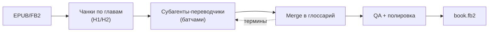

# book-translate-ru

[](https://www.python.org/)
[](LICENSE)

Художественный перевод книг EN-RU для AI-агентов. EPUB/FB2 режется на чанки по границам глав, чанки переводят параллельные субагенты с общим глоссарием, затем идут грамматическая и литературная полировка и сборка FB2 с XSD-валидацией.



## Содержание

- [Установка](#установка)
  - [Требования](#требования)
  - [Установка навыка](#установка-навыка)
- [Использование](#использование)
  - [Быстрый старт](#быстрый-старт)
  - [Серия книг](#серия-книг)
  - [Возобновление после сжатия контекста](#возобновление-после-сжатия-контекста)
- [Обзор](#обзор)
- [Как это работает](#как-это-работает)
- [Конфигурация](#конфигурация)
- [Ключевые особенности](#ключевые-особенности)
  - [Resume-протокол](#resume-протокол)
  - [Глоссарий с обратной связью](#глоссарий-с-обратной-связью)
  - [Оркестратор - не исполнитель](#оркестратор---не-исполнитель)
- [Благодарности](#благодарности)

## Установка

### Требования

| Инструмент | Назначение |
|---|---|
| Python 3.11+ | Скрипты пайплайна. Конфиг `config.toml` парсится stdlib `tomllib`, fallback-парсера нет |
| Pandoc | Конвертация исходника EPUB/FB2 в Markdown на шаге 1 |
| `beautifulsoup4`, `lxml` | Ставятся через `pip install -r requirements.txt` |

```bash
pip install -r requirements.txt
python3 {baseDir}/scripts/shared/config.py   # smoke-проверка конфига, печатает DEFAULTS
```

### Установка навыка

Папка скилла кладётся в skills-каталог платформы:

| Платформа | Путь |
|---|---|
| Общее решение | `~/.agents/skills/book-translate-ru/` |
| Claude Code | `~/.claude/skills/book-translate-ru/` |
| Kilo Code | `~/.kilo/skills/book-translate-ru/` |

**Клонированием.** Подставьте путь своей платформы из таблицы, например для Claude Code:

```bash
git clone https://github.com/Arondy/book-translate-ru.git ~/.claude/skills/book-translate-ru
```

Проще всего клонировать сразу внутрь skills-каталога: тогда имя папки уже правильное и ничего переносить не нужно.

**Из zip-архива.** Скачайте [архив ветки main](https://github.com/Arondy/book-translate-ru/archive/refs/heads/main.zip), распакуйте и перенесите папку в skills-каталог своей платформы. Распакованную папку `book-translate-ru-main` переименуйте в `book-translate-ru`. Имя папки должно совпадать с полем `name` в `SKILL.md`.

## Использование

### Быстрый старт

Укажите агенту путь к книге:

> Переведи книгу `MyBook.epub` на русский.

Агент проведёт книгу через все три фазы. На шаге 3 он поставит паузу, покажет собранный глоссарий и попросит проверить терминологию. После подтверждения переведёт чанки батчами, отполирует и соберёт FB2.

Результат в `<книга>_temp/`: `book.fb2` и `post_mortem.md` с анализом качества.

### Серия книг

Если книга - часть серии и есть переводы предыдущих томов, дайте агенту пути к ним. Он изучит стиль, терминологию и обращения к читателю и закрепит единую схему в `словарь_терминов.md` и `голос_книги.md`. Подробнее - `references/phase-1-prepare.md`, раздел 1.1.

### Возобновление после сжатия контекста

```bash
python3 {baseDir}/scripts/shared/load_state.py "<temp_dir>"
```

Скрипт покажет текущий шаг, фазу и путь к файлу с инструкциями. После этого агент читает нужный `references/phase-N-*.md` и продолжает.

## Обзор

`book-translate-ru` - skill по спецификации [Agent Skills](https://agentskills.io/): Claude Code, OpenAI Codex, GitHub Copilot, Kilo Code и другие платформы. Репозиторий не приложение, а набор инструкций, промптов и Python-скриптов.

Пайплайн состоит из девяти шагов в трёх фазах.

**Подготовка.** Исходник конвертируется в Markdown и режется на чанки по H1/H2. По умолчанию один чанк равен одной главе. Попутно собираются эпиграфы, сноски и структура, создаётся глоссарий и фиксируется голос книги.

**Перевод.** Субагенты переводят чанки батчами по 4-8 за раз. Каждый получает таблицу терминов, контекст соседей и промпт перевода. Новые термины, алиасы и гипотезы о роде персонажей мержатся в глоссарий транзакционно.

**Финал.** Структурная и смысловая проверки, сверка местоимений, пофрагментная полировка по 20 грамматическим и 14 литературным категориям, пост-мортем и сборка FB2.

## Как это работает

| Фаза | Шаги | Что делает |
|---|---|---|
| 1. Подготовка | 1-3 | EPUB/FB2 в Markdown-чанки по H1/H2, структурные units: эпиграфы и сноски, глоссарий, голос книги |
| 2. Перевод | 4-6 | План прогона, параллельный перевод субагентами, транзакционный merge meta в глоссарий |
| 3. Финал | 7-9 | Verify, QA, сверка местоимений, полировка, пост-мортем, сборка `book.fb2` |

Скрипты отвечают за структуру: чанкование, хеши, сбор данных для диагностики. Смысл переводят субагенты, а главный агент только запускает их и мержит результаты.

## Конфигурация

Настройки лежат в `config.toml`. Скопируйте его в рабочую директорию рядом с `<книга>_temp/` и правьте под конкретную книгу либо используйте базовый вариант без изменений. Файл ищется по порядку: `cwd/config.toml`, `cwd/*_temp/config.toml`, корень скилла. Значения по умолчанию заданы в `DEFAULTS` внутри `scripts/shared/config.py`.

| Секция | Ключи, которые стоит трогать |
|---|---|
| `[chunking]` | `chapter_only` - один чанк равен одной главе; `chunk_size` |
| `[parallelism]` | `batch_size` - рекомендация оркестратору, скрипты её не читают |
| `[quality]`, `[polish]` | `ratio_min` / `ratio_max` - допустимая длина перевода |
| `[retry]` | `max_retries`, `min_output_chars` |

## Ключевые особенности

### Resume-протокол

`progress.json` хранит номер текущего шага. После сжатия контекста агент сверяется с ним и подгружает только файл текущей фазы из `references/`. Каждая фаза лежит в отдельном файле, поэтому контекст оркестратора остаётся небольшим на протяжении всей книги.

### Глоссарий с обратной связью

Субагенты предлагают новые термины в `meta.json`. `merge_meta.py` мержит их транзакционно: либо применяются все изменения, либо ни одного. `find-duplicates` ловит близкие дубликаты, которые пропустил точный матч: единственное и множественное число, краткие и полные имена, пересечения алиасов. После каждого батча новые термины уходят на проверку пользователю.

`glossary.json` защищён от разрушающих записей: поле `version: 2` обязательно, скрипты не подменяют повреждённый глоссарий пустым дефолтом и не пишут пустой список терминов поверх непустого. `validate-glossary [--fix]` обязателен после каждой записи. Поле `id` генерируется из английского названия автоматически: `Tracker's Lenses` становится `trackers_lenses`.

Субагенты добавляют термины с `confidence: "low"`. Пользователь подтверждает вариант командой `confirm-terms`:

```bash
python3 {baseDir}/scripts/phase1_prepare/glossary.py confirm-terms "<temp_dir>" --all
python3 {baseDir}/scripts/phase1_prepare/glossary.py confirm-terms "<temp_dir>" --source "Brightsand"
```

`--all` берёт все новые термины, `--source` и `--id` точечно. Команда поднимает уверенность до `high`, дописывает `notes: "confirmed by user"` и не трогает уже подтверждённые.

### Оркестратор - не исполнитель

Главный агент не переводит, не полирует и не делает QA. Каждый субагент видит только свой чанк, промпт и инъецированные данные, поэтому стиль не дрейфует от предыдущих глав, а книги из сотен чанков проходят целиком.

## Благодарности

- Технический пайплайн вдохновлён проектом [deusyu/translate-book](https://github.com/deusyu/translate-book).
- Смысловой пайплайн перевода, QA и полировки - [NW15D/sunny-narrator](https://github.com/NW15D/sunny-narrator).